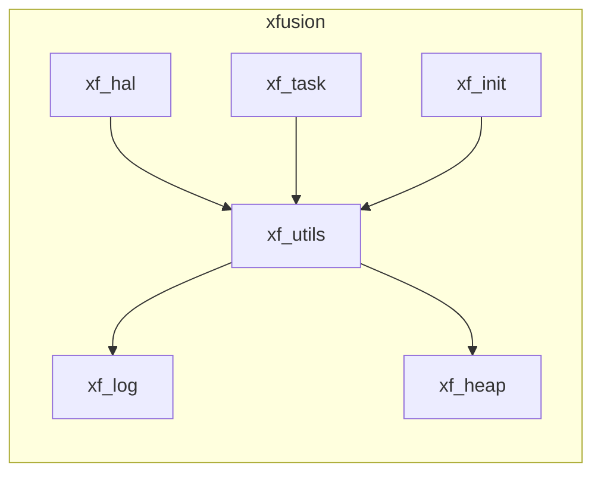

# XFusion 详情

## 背景

我们在逐步开源了 xf_utils、xf_log、xf_heap、xf_init、xf_hal 和 xf_task 这些组件后，发现中间件的移植往往需要一定的对接工作。对于**应用开发者**来说，使用这些组件还需要移植，并不算十分便捷；对于**底层移植者**而言，无论是通过回调函数、对接宏，还是弱定义来进行移植，方法各异，过程繁琐复杂；而对于**组件贡献者**来说，面对不同的 SDK，需要完成的移植例程和工程构建脚本种类繁多，令人头疼。在这种情况下，我们开始思考是否可以设计一个框架，使**底层移植者**、**应用开发者**和**组件贡献者**能够更清晰、更便捷地完成各自的任务。于是，xfusion 嵌入式开发框架应运而生。

## 特点

1. 移植者可以在不魔改原生工程下，进行对接
2. 使用 xf_build python 语法直接生成编译，简化构建方法，统一构建语言
3. 支持 menuconfig 可以对模块进行可视化配置
4. 自带包管理器，可以通过命令行下载第三方组件包
5. 支持独立工程创建，每个基于 xfusion 的工程简单而方便

## xfusion 详解

在 xfusion 框架中，我们结合了之前开源的六个项目。例如，在 xf_utils 中，底层的内存管理依赖于 xf_heap，而格式化日志的打印功能则通过 xf_log 来实现。

通过完善 HAL（硬件抽象层）、任务管理（task）和日志打印接口的对接，开发者可以完全使用 xfusion 提供的 API 来进行开发，所有应用层的代码都可以构建在 xfusion 之上。

需要注意的是，不同的 SDK 封装程度不同。有些 SDK 功能虽然较为简单，但是我们的日志打印功能只需要对接一个串口打印函数即可。而对于一些功能更完善的 SDK，例如自带高级日志系统和内存管理算法的 SDK，我们可以选择屏蔽掉 xf_log 和 xf_heap，直接将 SDK 自带的功能与 xf_utils 对接。这种对接方式具有很大的灵活性，能根据具体需求进行调整。

在移植过程中，最具挑战性的部分可能是 xf_hal 的对接。xf_hal 提供了统一的基础硬件 API，正因为有了它，我们的代码才能在不同平台间无缝切换。当需要更换平台时，开发者只需修改与 xf_hal 相关的移植部分，而应用层的逻辑可以保持不变。这种设计大大简化了应用开发者的工作量，帮助他们专注于应用逻辑的开发，而不用担心底层实现的差异。

再配合 xf_task 可以做到在裸机上完成多任务（有 rtos 的也不影响）。对于一些硬件资源有限的设备非常方便
xf_init 也能做到对每个模块的对接起到解耦的作用。

这里有个难题，就是对于开发者而言。不同的 sdk 可能工程构建形式是不一样的。stm32 有 keil IAR cubeIDE 等 IDE。esp32 使用 cmake 脚本构建工程。所以，我们设计一个简单的脚本工具 xf_build。方便收集所有编译信息，然后通过插件模式，生成对应的构建脚本或者工程，从而完成编译功能。

## xf_build 的工作原理和使用

xf_build 本质是一个 python 库。它可以通过 xf_project.py 识别为一个 xfusion 工程。然后通过 xf_build 将工程内需要的编译信息收集成为一个 json 文件。该文件可以通过后续移植插件 jinja2 模板。转换成为 sdk 需要的构建脚本。最后，启动编译

对于移植者来说：底层的 xf_build 插件需要移植者对接
对于开发者而言：xf_project.py 和 xf_collect.py 会成为工程中统一的构建脚本。使用 python 语法。结构非常简单。
对于组件贡献者来说：贡献的中间件只需要对接 xfusion 的硬件抽象层和 xf_build 构建脚本。即可为所有的仓库提供一个统一的对接方式。

此外，xf_build 还提供包管理器的功能。用户可以通过向 [components](https://github.com/coralZone/components) 提供 PR 可以贡献组件包。并且通过 xf 指令可以下载和查找组件包。
