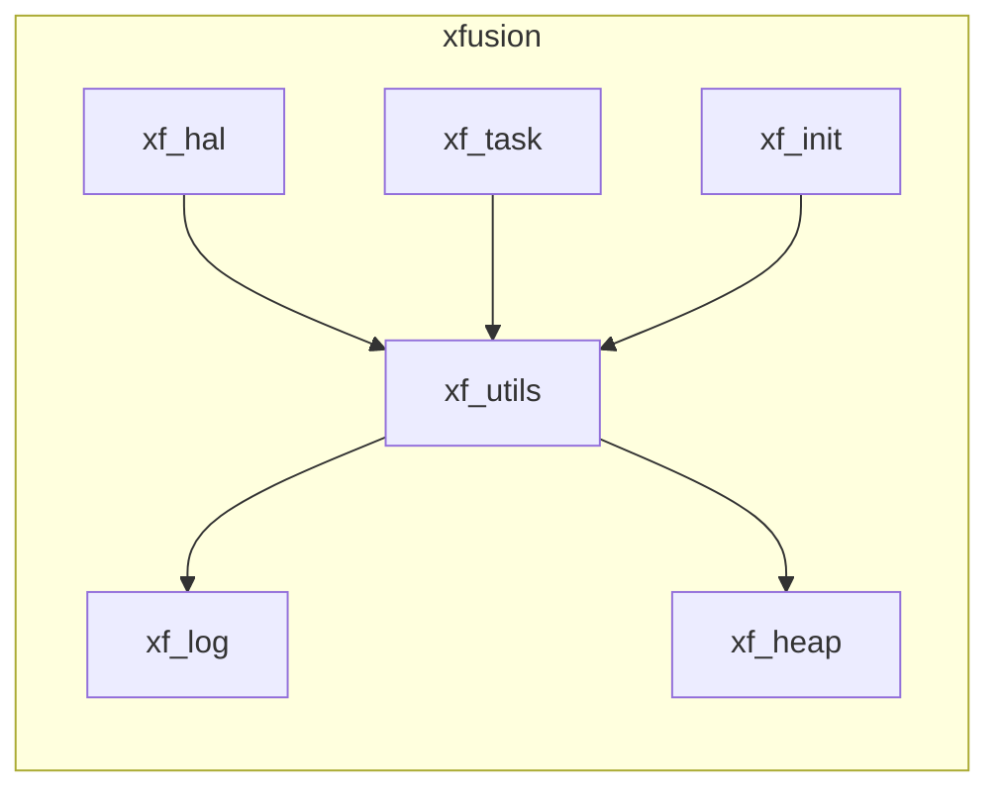

# XFusion 轻量级嵌入式框架

## 介绍 xfusion

### 背景

我们在逐步开源了 xf_utils、xf_log、xf_heap、xf_init、xf_hal 和 xf_task 这些组件后，发现中间件的移植往往需要一定的对接工作。对于**应用开发者**来说，使用这些组件还需要移植，并不算十分便捷；对于**底层移植者**而言，无论是通过回调函数、对接宏，还是弱定义来进行移植，方法各异，过程繁琐复杂；而对于**组件贡献者**来说，面对不同的 SDK，需要完成的移植例程和工程构建脚本种类繁多，令人头疼。在这种情况下，我们开始思考是否可以设计一个框架，使**底层移植者**、**应用开发者**和**组件贡献者**能够更清晰、更便捷地完成各自的任务。于是，xfusion 嵌入式开发框架应运而生。

### 特点

1. 移植者可以在不魔改原生工程下，进行对接
2. 使用 xf_build python语法直接生成编译，简化构建方法，统一构建语言
3. 支持 menuconfig 可以对模块进行可视化配置
4. 自带包管理器，可以通过命令行下载第三方组件包
5. 支持独立工程创建，每个基于 xfusion 的工程简单而方便

### xfusion详解



在 xfusion 框架中，我们结合了之前开源的六个项目。例如，在 xf_utils 中，底层的内存管理依赖于 xf_heap，而格式化日志的打印功能则通过 xf_log 来实现。

通过完善 HAL（硬件抽象层）、任务管理（task）和日志打印接口的对接，开发者可以完全使用 xfusion 提供的 API 来进行开发，所有应用层的代码都可以构建在 xfusion 之上。

需要注意的是，不同的 SDK 封装程度不同。有些 SDK 功能虽然较为简单，但是我们的日志打印功能只需要对接一个串口打印函数即可。而对于一些功能更完善的 SDK，例如自带高级日志系统和内存管理算法的 SDK，我们可以选择屏蔽掉 xf_log 和 xf_heap，直接将 SDK 自带的功能与 xf_utils 对接。这种对接方式具有很大的灵活性，能根据具体需求进行调整。

在移植过程中，最具挑战性的部分可能是 xf_hal 的对接。xf_hal 提供了统一的基础硬件 API，正因为有了它，我们的代码才能在不同平台间无缝切换。当需要更换平台时，开发者只需修改与 xf_hal 相关的移植部分，而应用层的逻辑可以保持不变。这种设计大大简化了应用开发者的工作量，帮助他们专注于应用逻辑的开发，而不用担心底层实现的差异。

再配合 xf_task 可以做到在裸机上完成多任务（有rtos的也不影响）。对于一些硬件资源有限的设备非常方便
xf_init 也能做到对每个模块的对接起到解耦的作用。

这里有个难题，就是对于开发者而言。不同的 sdk 可能工程构建形式是不一样的。stm32 有 keil IAR cubeIDE 等 IDE。esp32 使用 cmake 脚本构建工程。所以，我们设计一个简单的脚本工具 xf_build。方便收集所有编译信息，然后通过插件模式，生成对应的构建脚本或者工程，从而完成编译功能。

### xf_build 的工作原理和使用

xf_build 本质是一个 python 库。它可以通过 xf_project.py 识别为一个 xfusion 工程。然后通过 xf_build 将工程内需要的编译信息收集成为一个 json 文件。该文件可以通过后续移植插件 jinja2 模板。转换成为 sdk 需要的构建脚本。最后，启动编译

对于移植者来说：底层的 xf_build 插件需要移植者对接
对于开发者而言：xf_project.py 和 xf_collect.py 会成为工程中统一的构建脚本。使用 python 语法。结构非常简单。
对于组件贡献者来说：贡献的中间件只需要对接 xfusion 的硬件抽象层和 xf_build 构建脚本。即可为所有的仓库提供一个统一的对接方式。

此外，xf_build 还提供包管理器的功能。用户可以通过向 [components](https://github.com/coralZone/components) 提供 PR 可以贡献组件包。并且通过 xf 指令可以下载和查找组件包。

## 如何使用 xfusion

1. clone 本仓库
2. 下载本仓库的子仓库
3. 激活当前仓库的工具链（对于导出的工程这一步可以不需要）
4. 激活 xfusion
```shell
. ./export.sh <paltform>
```
5. 使用 xf 命令创建一个工程
```shell
xf create <project name>
```
6. 进入工程并编译，或者导出
```shell
cd <project name>
xf build # 或者 xf export
```

在 xfusion 开发过程中。xfusion 接管了原生的 main 函数。用户需要在 xf_main 函数内进行操作，且 xf_main 不能阻塞。

## 更多教程和文档

欢迎访问网站 [coral](http://www.coral-zone.cc/)
<a href="http://www.coral-zone.cc/">
  <svg data-v-300cc138="" version="1.1" width="10rem" height="10rem" fill="brown" xmlns="http://www.w3.org/2000/svg" xmlns:xlink="http://www.w3.org/1999/xlink" viewBox="0 0 2000 2000" class="fill-primary"><path d="M107.86,572.58c2.56-1.27,5.26-2.34,7.67-3.85C286.37,461.59,457.18,354.42,628,247.25c2.88-1.81,5.79-3.58,9.2-5.69
    c150.64,101.09,301.22,202.15,452.05,303.37c-2.68,137.52-5.36,274.93-8.04,412.54c-3.42,1.07-5.48-1.48-7.73-2.83
    c-51.92-31.14-103.79-62.37-155.66-93.59c-97.43-58.63-194.87-117.27-292.31-175.9c-2.19-1.32-4.48-2.48-7.75-4.28
c-0.21,3.42-0.52,5.91-0.49,8.4c0.5,53.46,1.03,106.92,1.55,160.37c0.53,54.25,1.05,108.5,1.58,162.74
    c0.52,53.72,1.04,107.44,1.58,161.16c0.4,38.71,1,77.42,1.09,116.13c0.01,5.57,2.74,7.83,6.6,10.35
    c80.44,52.56,160.85,105.18,241.27,157.78c38.78,25.36,77.57,50.7,116.35,76.07c2.35,1.54,4.61,3.2,7.66,5.32
    c-122.29,77.27-243.76,154.03-365.53,230.97c-2.36-1.39-4.63-2.61-6.79-4c-168.49-108.39-336.96-216.81-505.52-325.1
    c-4.5-2.89-6.37-5.86-6.35-11.31c0.15-37.14-0.07-74.28-0.18-111.41c-0.15-48.99-0.25-97.97-0.46-146.96
    c-0.25-56.88-0.62-113.76-0.93-170.65c-0.15-27.39-0.25-54.78-0.45-82.17c-0.02-3.11-0.57-6.22-0.88-9.33
    C107.86,797.02,107.86,684.8,107.86,572.58z"></path><path d="M1361.25,1775.4c-25.96-17.52-51.89-35.1-77.9-52.56c-121.97-81.9-243.94-163.81-366.03-245.53
    c-5.23-3.5-7.17-7.07-7.03-13.34c1.14-48.97,1.88-97.95,2.8-146.92c1.02-54.24,2.07-108.48,3.16-162.71
    c0.6-30.01,1.31-60.02,2-90.03c0.04-1.54,0.32-3.07,0.64-5.94c154.36,92.87,308.02,185.32,462.99,278.56c0-3.95,0.02-6.46,0-8.98
    c-0.7-79.01-1.39-158.02-2.12-237.03c-0.5-54.51-1.05-109.03-1.58-163.54c-0.52-53.46-1.03-106.92-1.59-160.38
    c-0.14-13.43-0.75-26.86-0.56-40.28c0.07-4.9-2.42-6.95-5.88-9.2c-24.5-15.93-48.93-31.98-73.39-47.97
    c-94.53-61.82-189.06-123.63-283.59-185.45c-2.61-1.71-5.16-3.51-8.83-6.01c122.47-77.39,244.1-154.25,365.76-231.12
    c3.08,1.91,5.77,3.53,8.41,5.23c167.61,107.83,335.2,215.7,502.89,323.4c5.54,3.56,7.49,7.31,7.49,13.9
    c-0.07,175.96,0.07,351.92,0.25,527.88c0.08,85.61,0.29,171.21,0.46,256.82c0.04,20.81-0.06,41.62,0.39,62.42
    c0.13,6.07-1.97,9.38-7.08,12.58c-168.24,105.35-336.37,210.87-504.49,316.41c-4.82,3.03-9.35,6.52-14.01,9.8
    C1363.36,1775.4,1362.31,1775.4,1361.25,1775.4z"></path></svg>
</a>


