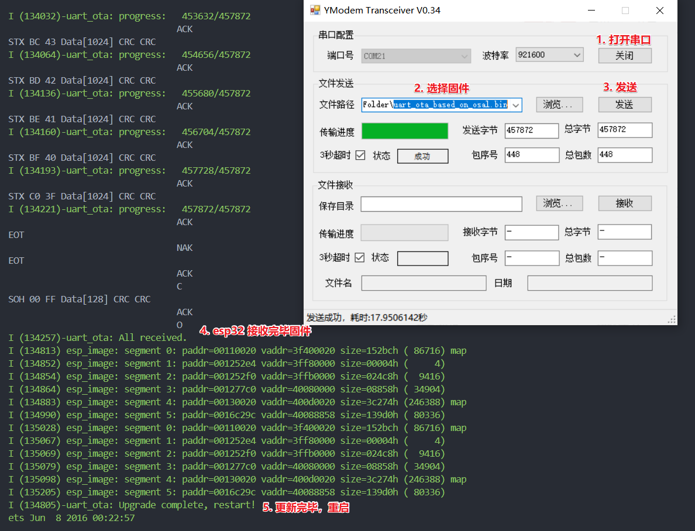
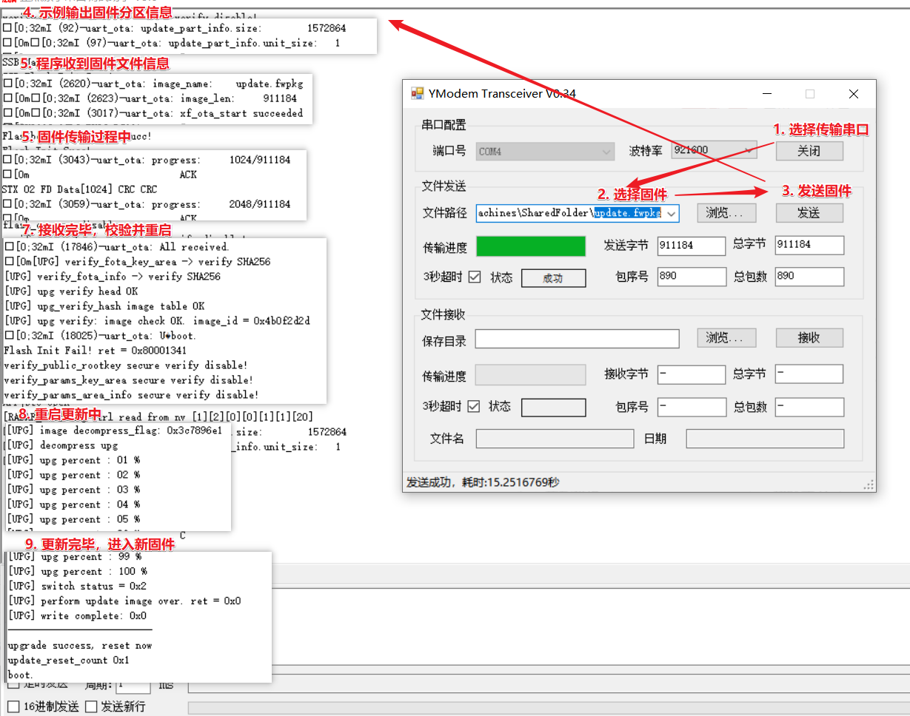

# uart_ota_based_on_osal - 串口 Ymodem OTA 示例

## 支持情况

此实例使用 xf_osal, 只支持了同步获取固件数据方式，也就是在同一个任务内 `阻塞调用 xf_ymodem 获取数据 -> 阻塞写入固件数据`。

此实例**不支持异步获取数据。** 具体来说，这种方式是是获取数据时必须切换一次上下文才能获取到数据，如下流程：`申请获取数据 -> 未获取到时释放 CPU 让获取数据的状态机运行，直到获取完数据 -> 切回当前循环 -> 阻塞写入固件数据`。

1.  espressif

    1.  esp32

1.  nearlink

    1.  ws63

## 示例简述

本示例演示如何使用 xf_ota 接口升级本机固件。

## 如何使用

1.  所需的软件和硬件。

    1.  外部软件包。

        1.  xf_ymodem 组件：
        
            [x-eks-fusion/xf_ymodem: xf_ymodem 是基于 XFusion 接口的 ymodem 模块](https://github.com/x-eks-fusion/xf_ymodem)

            如果 `uart_ota_based_on_osal/components` 内没有此组件，需手动克隆至此路径。
        
        1.  支持 Ymodem 的上位机：
        
            [YModem V0.43 · miuser/YModem - Gitee.com](https://gitee.com/miuser00/ymodemwin/releases/tag/V0.43)

            经测试，Xshell 在 WS63 上运行此程序时无法正常下载（运行 `xf_ymodem` 内的 example 正常），推测是 Xshell 对时序要求较为严格。

    1.  硬件。

        esp32 或 ws63.

1.  配置。

    见 `main/XFKconfig`, 需要根据不同平台配置串口号、波特率、引脚。

1.  构建和烧录步骤与要点。

    无。

### esp32 的使用步骤

1.  编译此固件。

    ```bash
    cd uart_ota_based_on_osal
    # 导出 esp-idf 及 XFusion 环境，对此步骤有疑问请见入门文档
    get_idf5.0; get_xf esp32
    # 之后打开菜单，并根据实际情况配置传输串口（不是调试串口）
    # 注意 xf_osal 选择 freertos
    xf menuconfig;
    # 编译
    xf build;
    # 烧录并自行打开 esp32 调试串口监视器
    xf flash; 
    ```

1.  编译完毕后，使用此示例编译出的固件作为新固件升级：

    复制 `xfusion/boards/espressif/esp32/build/uart_ota_based_on_osal.bin` 到 windows 环境，供后续升级使用。

1.  打开 [YModem V0.43 · miuser/YModem - Gitee.com](https://gitee.com/miuser00/ymodemwin/releases/tag/V0.43) 上位机，打开传输串口，选择刚刚复制的固件传输。

    

### ws63 的使用步骤

1.  编译此固件。

    ```bash
    cd uart_ota_based_on_osal
    # 导出 XFusion 环境，对此步骤有疑问请见入门文档
    get_xf ws63
    # 之后打开菜单，并根据实际情况配置传输串口（不是调试串口）
    # 注意 xf_osal 选择 cmsis
    xf menuconfig
    # 编译
    xf build
    # 烧录并自行打开 ws63 串口监视器
    xf flash
    ```

1.  编译完毕后，使用此示例编译出的固件作为新固件升级：

    1.  如果 `xfusion/sdks/fbb_ws63/src/tools/bin/lzma_tool/` 缺少 `lzma_tool`，则需要下载 [lzma_tool](https://gitee.com/HiSpark/fbb_ws63/blob/master/src/build/config/target_config/ws63/sign_encry/lzma_tool) 到 `xfusion/sdks/fbb_ws63/src/tools/bin/lzma_tool/` (需要新建 lzma_tool 文件夹)。

    1.  制作升级包：

        ```bash
        python3 <xfusion 所在目录>/sdks/fbb_ws63/src/build/config/target_config/ws63/build_ws63_update.py
        ```

    1.  随后升级包输出到 `xfusion/sdks/fbb_ws63/src/output/ws63/upgrade/update.fwpkg`，并且复制到 windows 环境，供后续升级使用。

1.  打开 [YModem V0.43 · miuser/YModem - Gitee.com](https://gitee.com/miuser00/ymodemwin/releases/tag/V0.43) 上位机，打开传输串口，选择刚刚复制的固件传输。

    

## 常见问题

无。

## 运行日志

以下是 esp32 的参考运行日志。

```
I (43)-uart_ota: update_part_info.size:        1048576
I (44)-uart_ota: update_part_info.unit_size:   1
I (116333)-uart_ota: image_name:    uart_ota_based_on_osal.bin
I (116334)-uart_ota: image_len:     457872
I (116335)-uart_ota: xf_ota_start succeeded
I (116405)-uart_ota: progress:     1024/457872
I (116429)-uart_ota: progress:     2048/457872
# 收包过程省略
I (134221)-uart_ota: progress:   457872/457872
I (134257)-uart_ota: All received.
I (134813) esp_image: segment 0: paddr=00110020 vaddr=3f400020 size=152bch ( 86716) map
I (134852) esp_image: segment 1: paddr=001252e4 vaddr=3ff80000 size=00004h (     4) 
I (134854) esp_image: segment 2: paddr=001252f0 vaddr=3ffb0000 size=024c8h (  9416) 
I (134864) esp_image: segment 3: paddr=001277c0 vaddr=40080000 size=08858h ( 34904) 
I (134883) esp_image: segment 4: paddr=00130020 vaddr=400d0020 size=3c274h (246388) map
I (134990) esp_image: segment 5: paddr=0016c29c vaddr=40088858 size=139d0h ( 80336) 
I (135028) esp_image: segment 0: paddr=00110020 vaddr=3f400020 size=152bch ( 86716) map
I (135067) esp_image: segment 1: paddr=001252e4 vaddr=3ff80000 size=00004h (     4) 
I (135069) esp_image: segment 2: paddr=001252f0 vaddr=3ffb0000 size=024c8h (  9416) 
I (135079) esp_image: segment 3: paddr=001277c0 vaddr=40080000 size=08858h ( 34904) 
I (135098) esp_image: segment 4: paddr=00130020 vaddr=400d0020 size=3c274h (246388) map
I (135205) esp_image: segment 5: paddr=0016c29c vaddr=40088858 size=139d0h ( 80336) 
I (134805)-uart_ota: Upgrade complete, restart!
ets Jun  8 2016 00:22:57

rst:0xc (SW_CPU_RESET),boot:0x13 (SPI_FAST_FLASH_BOOT)
# 重启进入新下载的程序
```

以下是 ws63 的参考运行日志（xf_ymodem 模块开了调试）。

```
# 示例输出固件分区信息
I (92)-uart_ota: update_part_info.size:        1572864
I (97)-uart_ota: update_part_info.unit_size:   1
# 程序收到固件文件信息
I (2620)-uart_ota: image_name:    update.fwpkg
I (2623)-uart_ota: image_len:     911184
I (3017)-uart_ota: xf_ota_start succeeded
				C
STX 01 FE Data[1024] CRC CRC
# 开始传输
I (3043)-uart_ota: progress:     1024/911184
# ...
# 传输固件过程中可能出错，xf_ymodem 会自动重试
I (11433)-uart_ota: progress:   516096/911184
				ACK
STX F9 06 Data[1024] CRC CRC
xf_ymodem[xf_ymodem.c:362(xf_ymodem_check_packet)]: crc error, expect(0x9803), calculated(0xd88b)
				NAK
STX F9 06 Data[1024] CRC CRC
I (11513)-uart_ota: progress:   517120/911184
# ...
# 固件接收完毕，平台内部校验
I (17846)-uart_ota: All received.
[UPG] verify_fota_key_area -> verify SHA256
[UPG] verify_fota_info -> verify SHA256
[UPG] upg verify head OK
[UPG] upg_verify_hash image table OK
[UPG] upg verify: image check OK. image_id = 0x4b0f2d2d
# 重启进入升级流程
boot.
Flash Init Fail! ret = 0x80001341
verify_public_rootkey secure verify disable!
verify_params_key_area secure verify disable!
# ...
# 升级流程启动
[UPG] verify_fota_key_area -> verify SHA256
[UPG] verify_fota_info -> verify SHA256
[UPG] upg verify head OK
[UPG] upg_verify_hash image table OK
[UPG] upg verify: image check OK. image_id = 0x4b0f2d2d
[UPG] package info total= 0x13b000, finished = 0x0
[UPG] update image number = 0x1
[UPG] update firmware number = 0x1
[UPG] start perform update image : 0x4b0f2d2d
[UPG] upg verify: image check OK. image_id = 0x4b0f2d2d
[UPG] image decompress_flag: 0x3c7896e1
[UPG] decompress upg
[UPG] upg percent : 01 %
[UPG] upg percent : 02 %
[UPG] upg percent : 03 %
[UPG] upg percent : 04 %
# ...
[UPG] upg percent : 99 %
[UPG] upg percent : 100 %
[UPG] switch status = 0x2
[UPG] perform update image over. ret = 0x0
[UPG] write complete: 0x0
--------------------------
upgrade success, reset now
update_reset_count 0x1
# 升级完毕，重启进入新程序
boot.
Flash Init Fail! ret = 0x80001341
verify_public_rootkey secure verify disable!
verify_params_key_area secure verify disable!
```
